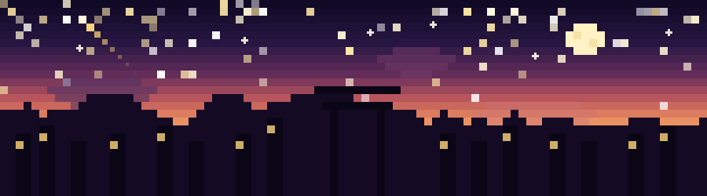

<p align="center">
  
</p>

<p align="center">
  
</p>

<p align="center">
  <a href="https://www.linkedin.com/in/hoquylyka">
    
  </a>
  <a href="mailto:hoquyly.dev@gmail.com">
    
  </a>
  <a href="https://lyhoquy.github.io/Portfolio/">
    
  </a>
  
</p>

---

## `> whoami` 👨‍💻

```text
🎓  IT student @ Da Nang University of Science and Technology (2022 – 2026)
💻  Frontend Developer — I like standing between design and code:
    understanding why a UI works, then building it myself
🎯  Goal: carry an idea from UI to a finished, working product independently
📍  Based in Đà Nẵng, Vietnam
```

### 🔭 Currently Working On

- 🚦 **Real-Time Traffic Navigation Dashboard** — graduation project with live heatmaps, WebSocket updates, and OSRM routing
- 🌐 **Portfolio migration** — rebuilding [Kiandas Portfolio](https://lyhoquy.github.io/Portfolio/) from static HTML → Next.js + Tailwind + Drizzle ORM
- 📱 **React Native** — deepening mobile development skills

---

## 🛠️ Tech Stack

<details open>
<summary><b>Languages</b></summary>
<br>


</details>

<details open>
<summary><b>Frameworks & Libraries</b></summary>
<br>


</details>

<details open>
<summary><b>Tools & Design</b></summary>
<br>


</details>

---

## 💼 Experience

> **Frontend Development Intern — NCC**
> `Nov 2025 – Mar 2026`

- 🔹 Built and maintained responsive web interfaces with ReactJS, translating UI designs into reusable components
- 🔹 Implemented frontend features and integrated APIs across screen sizes and browsers
- 🔹 Collaborated with designers and developers to keep implementation consistent with UI specs

---

## 🧩 Featured Projects

<table>
  <tr>
    <td width="50%">
      <h3 align="center">🚦 Traffic Navigation Dashboard</h3>
      <p align="center"><em>Graduation Project</em></p>
      <p align="center">
        Live traffic congestion heatmaps, real-time vehicle/incident updates over WebSocket, and interactive reroute flow via OSRM routing API
      </p>
      <p align="center">
        
        
        
        
      </p>
    </td>
    <td width="50%">
      <h3 align="center">🌐 <a href="https://lyhoquy.github.io/Portfolio/">Kiandas — Portfolio</a></h3>
      <p align="center"><em>Personal Portfolio & Case Studies</em></p>
      <p align="center">
        Personal portfolio showcasing projects and case studies; migrating from static HTML to Next.js with a full design system
      </p>
      <p align="center">
        
        
        
      </p>
    </td>
  </tr>
  <tr>
    <td width="50%">
      <h3 align="center">📚 <a href="https://github.com/Binh1012/Vocabulary-Learning-by-PlashCard">Vocabulary Flashcards</a></h3>
      <p align="center"><em>Mobile Learning App</em></p>
      <p align="center">
        Flashcard-based English vocabulary learning app with quizzes, spaced repetition, and progress tracking
      </p>
      <p align="center">
        
        
        
      </p>
    </td>
    <td width="50%">
      <h3 align="center">🎨 More coming soon...</h3>
      <p align="center"><em>Stay tuned!</em></p>
      <p align="center">
        Always building something new. Check out my <a href="https://github.com/lyhoquy?tab=repositories">repositories</a> for the latest.
      </p>
    </td>
  </tr>
</table>

---

## 📊 GitHub Stats

<p align="center">
  
  
</p>

<p align="center">
  
</p>

<p align="center">
  
</p>

---

## 🐍 Contribution Snake

<p align="center">
  <picture>
    <source media="(prefers-color-scheme: dark)" srcset="https://raw.githubusercontent.com/lyhoquy/lyhoquy/output/github-snake-dark.svg" />
    <source media="(prefers-color-scheme: light)" srcset="https://raw.githubusercontent.com/lyhoquy/lyhoquy/output/github-snake.svg" />
    
  </picture>
</p>

---

<p align="center">
  
</p>

<p align="center">
  <sub>⭐ From <a href="https://github.com/lyhoquy">lyhoquy</a> — made with ❤️ from Vietnam</sub>
</p>
